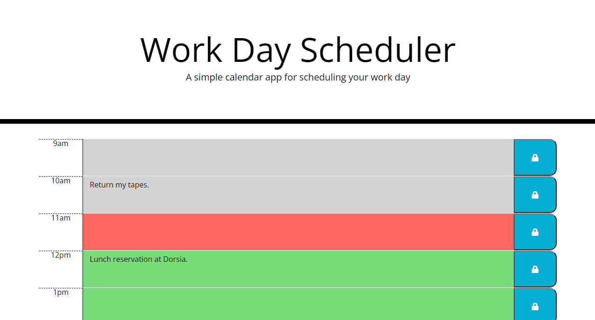

# Work Day Scheduler

This brief application is a short day planner that allows a user to schedule
events throughout their day. Events can be saved so that they may be referred
to later. Below is a screenshot of the application, which you can find [here](https://cameronmseibel.github.io/work-day-scheduler/)

